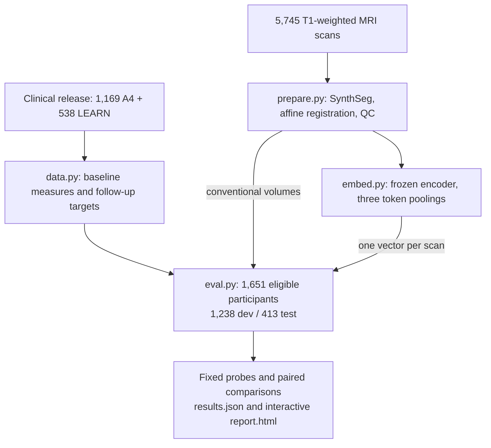
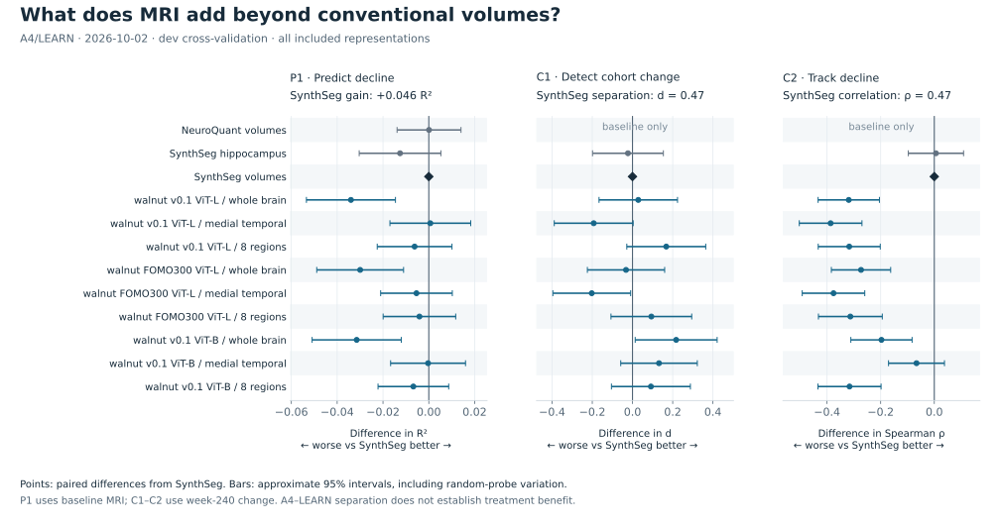

# A4/LEARN imaging eval

**Does a brain-MRI representation tell us more about future cognitive decline than conventional brain volumes?**
This benchmark takes one vector per T1-weighted MRI scan, fits small prediction models, and compares representations
on the same participants. The main score is the extra prediction of decline that MRI adds beyond clinical assessments
and a blood biomarker. Separate tasks test disease biomarkers, anatomy, and change between scans.

[Run a checkpoint](#run-a-checkpoint) · [How it was built](#how-it-was-built) · [Tasks](#tasks-and-targets) ·
[Results](#current-results) · [Rebuild the inputs](#rebuild-the-inputs)

## Why this eval exists

The [September 17 meeting](https://docs.google.com/document/d/188dtbu0hEslN0U4gP0d-XtC_2vMo-X2GWsKZsyOoOto/edit)
in [#smri-clinical-evals](https://discord.com/channels/1025299671226265621/1547697725947125822) called for a focused,
clinically relevant test of structural-MRI models. Three decisions shape this implementation:

- **Predict something useful beyond what is already measured.** Compare MRI with a strong clinical and blood-test
  baseline, then compare embeddings with inexpensive SynthSeg volumes on exactly the same people.
- **Distinguish prognosis from treatment benefit.** As clarified in the
  [September 21 discussion](https://discord.com/channels/1025299671226265621/1547697725947125822/1551735593686409327),
  predicting who declines can help adjust for differences between trial participants. It does not establish who
  benefits from a drug. This version measures prognosis; it does not estimate treatment effects or identify responders.
- **Measure change within a person.** The
  [September 28 proposal](https://discord.com/channels/1025299671226265621/1547697725947125822/1554205236338360340)
  motivates the longitudinal tasks: a representation that describes anatomy well may still miss meaningful change.

## Run a checkpoint

The clinical tables and prepared scans already exist on the Sophont cluster. For a new checkpoint, run **embedding
and evaluation only**. You need Linux, [uv](https://docs.astral.sh/uv/), SLURM access, and access to the A4/LEARN release
under its data use agreement. This repository does not download the study data.

```bash
git clone https://github.com/SophontAI/a4-learn-eval.git
cd a4-learn-eval
uv sync --locked --python 3.13
mkdir -p /data/paul/a4/eval /data/paul/a4/mri/logs
```

Paths are fixed near the top of each script. The defaults use the shared cache under `/data/paul/a4` and overwrite
outputs there when rerun; coordinate runs using the same directories. The model-code dependency also requires the
existing `/data/paul/a4/smri-fm` checkout (commit `11e53ab`), set in [pyproject.toml](pyproject.toml).

1. Add a checkpoint to `MODELS` in [embed.py](embed.py), for example
   `"my-model": "/data/paul/checkpoints/my-model.pth"`. It must be supported by `fomo_tune.backbone.load_backbone`.
2. Add the matching identifier to `MODELS` in [eval.py](eval.py), for example `"My model": "my-model"`.
   Whole-brain, medial-temporal and eight-region poolings become separate rows. Keep the reference models.
3. Submit embedding, then an evaluation that waits for it to succeed. Run from the repo root:

```bash
embed_job=$(sbatch --parsable -p n --qos=high --account=sophont \
  --gres=gpu:1 -c 16 --mem=96G --array=0-7 \
  -o /data/paul/a4/mri/logs/embed_%A_%a.log \
  --wrap 'set -e; pids=""; for j in 0 1 2; do
    SHARD=$((SLURM_ARRAY_TASK_ID * 3 + j)) uv run --locked python embed.py &
    pids="$pids $!"
  done; for pid in $pids; do wait "$pid"; done')

sbatch --dependency=afterok:"$embed_job" -p c --qos=high --account=sophont \
  -c 64 --mem=256G -o /data/paul/a4/eval/eval_%j.log \
  --wrap 'uv run --locked python eval.py'
```

Embedding takes about four minutes for the three included checkpoints on eight GPUs; evaluation takes about six
minutes on 64 CPUs. More models take longer. Each GPU runs three of the 24 shards; a failed shard fails its array task.

4. Open **`/data/paul/a4/eval/report.html`** in a browser, copying it to your computer if needed. It contains the full
   scorecard, paired comparisons and task plots. The repo's [report.html](report.html) is a template; `eval.py` fills it.
5. Develop using **dev** scores. Once the checkpoint and pooling are final, add the exact representation name,
   such as `"My model, medial temporal"`, to `FROZEN` in `eval.py` and rerun to obtain its test score. The included
   reference models have already been scored on test; repeatedly consulting them does not create new validation.

Other encoders can supply the tables that `embed.py` writes: one parquet directory per `<model>_<pool>`, a unique
string `(BID, session)` MultiIndex, and finite numeric columns `e0, e1, …`. All baseline scans and the same paired
follow-up scans must be present. The current loader expects all three poolings; arbitrary encoder architectures
need their own extraction code.

## How it was built

**A4** enrolled 1,169 cognitively unimpaired, amyloid-positive participants, randomized to solanezumab or placebo for
240 weeks (about 4.6 years). The trial found no significant slowing of cognitive decline with solanezumab.
**LEARN** followed 538 amyloid-negative participants without treatment. It is an observational ageing comparison,
not A4's randomized placebo arm. See the [A4 trial paper](https://doi.org/10.1056/NEJMoa2305032).



**Participants.** The eligible set contains 1,118 A4 and 533 LEARN participants with a usable baseline scan and
NeuroQuant volumes; A4 also requires membership in the modified intention-to-treat set. Registration QC requires
brain-mask Dice ≥ 0.9 against the template; one of the 5,745 scans fails. Each task then requires its target and, for
prognostic gains, complete clinical covariates. Missing values are not imputed. Counts differ **between tasks**, but
every representation within a task is evaluated on the same participants.

**Scans.** A4 sessions `004`, `009`, `027`, `048`, `066` correspond to screening, weeks 12, 84, 168 and 240. LEARN uses
`006` at baseline and `066` at week 240. Prediction tasks use only baseline MRI; follow-up MRI is used for C1–C3.

**Representations.** SynthSeg segments 32 structures and supplies a brain mask. ANTs affine registration maps scans
to the 1 mm MNI152NLin2009cAsym template. Images are brain-masked and intensity-scaled, then padded to
`208 × 240 × 208` and z-scored within the brain before encoding. Frozen walnut patch tokens are pooled over the whole
brain, the medial temporal region, or eight regions concatenated. SynthSeg volumes are normalized by intracranial
volume, which is also included as a feature. NeuroQuant provides a second, baseline-only volume comparator.

## Tasks and targets

**PACC** is the Preclinical Alzheimer Cognitive Composite, combining four standardized cognitive tests; lower scores
are worse. **CDR** is the Clinical Dementia Rating; progression here means worsening from a global score of zero.
**p-tau217** is a blood biomarker. Amyloid and tau PET measure disease pathology, not MRI anatomy.

The **clinical baseline** contains age, sex, education, APOE ε4, baseline PACC and its four components, participant and
partner cognitive complaints, CDR sum of boxes, daily function, Cogstate C3, and log plasma p-tau217. Treatment arm is
also included. P1t adds two baseline tau PET summaries. Exact columns are in `CLINICAL` and `TAU` in [eval.py](eval.py).

| Task | Question / target | Dev / test participants | Headline |
|---|---|---:|---|
| **P1 — primary** | Does baseline MRI add prediction of PACC decline rate in A4 beyond clinical + blood measures? | **666 / 227** | **ΔR²** |
| P1 scan | Same decline rate, from MRI alone | 666 / 227 | R² |
| P1t | Does MRI add prediction after tau PET is available? | 219 / 77 | ΔR² |
| P2 | PACC change to week 240, among completers | 558 / 188 | ΔR² |
| P3 | CDR progression near week 240 | 602 / 202 | ΔAUROC |
| B1 | Baseline tau PET temporal meta-region SUVR from MRI alone (A4) | 278 / 96 | R² |
| B2 | Baseline amyloid PET centiloids from MRI alone (A4) | 839 / 279 | R² |
| B3 | Baseline log plasma p-tau217 from MRI alone (A4) | 779 / 261 | R² |
| S1 / S2 | Age / NeuroQuant hippocampal volume as % intracranial volume (A4 + LEARN) | 1,238 / 413 | R² |
| C1 | Does week-240 MRI change separate A4 from LEARN after linear age adjustment? | 820 / 269 with paired scans | d |
| C2 | Does that change index track PACC decline? | A4 subset of C1 with a valid slope | Spearman ρ |
| C3 | How large is that separation relative to short-interval MRI variability? | C1; denominator uses A4 with session `009` | Ratio |

NeuroQuant is excluded from S2 because it contains the target, and from C1–C3 because only baseline volumes are
available. Age and hippocampal prediction check retained information; they are not clinical endpoints.

### Why P1 is the headline

P1 fits a PACC slope over **all blinded-phase assessments**, requiring at least four assessments spanning two years.
Test-form offsets are subtracted first; negative slopes mean decline. No follow-up MRI enters the prediction. The
offsets in `FORM` are fixed estimates from a separate trial-data fit, not re-estimated within dev folds.

Alternate-visit slopes correlate at **0.77**, giving a Spearman–Brown full-slope reliability estimate of **0.87**.
The saved design comparison illustrates the precision for one fixed pair: walnut v0.1 ViT-L medial temporal vs SynthSeg.

| Target design | Dev participants | Approximate detectable R² difference |
|---|---:|---:|
| Week-240 change, scored on placebo | 283 | 0.043 |
| Week-240 change, scored on both arms | 558 | 0.032 |
| PACC slope, scored on both arms | 666 | 0.025 |

These are bootstrap-only diagnostics on predictions averaged across repeats, not a prospective sample-size guarantee.
P2 is motivated by [Devanarayan et al. (2025)](https://doi.org/10.1002/alz.70702), which trained on both arms but evaluated
natural decline on placebo. This repo uses ridge probes and scores both arms, so it does not reproduce that paper's
boosted models or trial-efficiency simulations.

### What the secondary endpoints mean

**P3** uses the release's CDR event indicator: positive global CDR at two consecutive blinded visits or at the last
visit. An event by week **252** is positive; no event with follow-up to at least week **228** is negative. Other outcomes
are unknown and excluded. A ridge score ranks participants for AUROC; this is not a survival model, calibrated risk
probability, or estimate of when progression occurs.

**C1–C3** start with **week-240 minus baseline vectors**. Within each training fold, the code removes an estimated
linear age effect, fits a ridge discriminant of A4 versus LEARN, and projects held-out changes onto that direction.
C1 divides the age-adjusted cohort difference by the index's A4 standard deviation. C2 correlates the index with
**negative PACC slope**, so positive ρ means more change accompanies more decline. C3 divides the cohort difference
by the standard deviation of A4 screening-to-week-12 change projected onto the same direction.

The earlier label “AD-specific change” refers to this **exploratory A4–LEARN contrast**. Age adjustment does not isolate
Alzheimer's from all cohort, treatment or scanner differences. C3 includes real short-term change and measurement
noise; the first A4 scan is at screening, not week zero. The report's hypothetical trial-size calculation assumes a
25% reduction in this contrast, equal variance and no attrition, not a validated treatment endpoint. Survival analysis,
treatment-response subgroups, WMH segmentation and ARIA prediction discussed by the team are not implemented here.

## Comparing models fairly

- **One participant split.** A fixed 75/25 dev/test split is stratified by cohort, treatment arm, APOE ε4 and tau-substudy
  membership. All scans from one person stay together. `SPLIT_SHA` checks the exact split and fold assignments.
- **Same probes and folds.** Dev uses five-fold cross-validation repeated ten times. Standardized ridge selects its
  penalty from a fixed grid. Clinical and MRI blocks get separate ridge fits, combined by a linear model trained on
  cross-fitted predictions. Test uses a fit on all dev participants. Dev scores average the ten repeat scores, rather
  than scoring the average prediction.
- **Paired uncertainty.** Representations share participant-bootstrap draws: 2,000 for P/B/S and 1,000 for C tasks.
  `results.json` stores bootstrap intervals. The report widens **differences from SynthSeg** using variability across
  24 random 1,024-dimensional probes; ordinary score/gain intervals remain bootstrap-only. This is an approximate
  calibration, not a full refit bootstrap or a dimension-matched null for every representation.
- **Two comparisons.** P1 gain is `R²(clinical + MRI) − R²(clinical)`. Beating volumes requires the further paired
  difference `R²(clinical + embedding) − R²(clinical + SynthSeg)` to be positive. Overlap of separate error bars does
  not answer that question.

R² can be negative on held-out data. AUROC measures ranking (0.5 is chance); d expresses separation in standard
deviations. Comparisons are unadjusted for multiple testing. Use P1 as the primary decision point and other tasks to
understand the result. Approximate P1 resolution is **0.023 R² on dev** and **0.048 on test** (80% power, using median
paired standard errors and random-probe variation). Small gains need external validation; repeated dev selection can
overfit this cohort.

## Current results

Snapshot from **2026-10-02**, dev only. The clinical baseline reaches **R² 0.274**; adding SynthSeg volumes brings it to
**0.320** (gain **+0.046**). The figure compares every included representation directly with that volume reference.
It also shows why separating cohorts and tracking cognitive decline are different goals.



Points to the right of zero favor the representation. Bars are approximate 95% paired intervals including
random-probe variation, matching the report's comparison logic. Zero inside the bar means an inconclusive comparison.
SynthSeg compared with itself has no error bar; NeuroQuant has no longitudinal measurements.

No included embedding clearly improves on SynthSeg for dev P1; whole-brain pooling performs worse. Some embeddings
separate A4 from LEARN more strongly on C1, yet their change indices track PACC decline less well on C2. The interactive
report adds biomarker prediction, anatomy checks, C3 and test results for frozen representations. These results
measure representation utility; they do not demonstrate treatment benefit.

Refresh the aggregate-only figure after a new run with `uv run --locked --group docs python figures.py`, then update
the dated prose and counts above if they changed.

## Rebuild the inputs

Only needed when recreating the cache. Follow setup above, then:

```bash
uv run --locked python data.py

sbatch -p n --qos=high --account=sophont --gres=gpu:1 -c 16 --mem=128G --array=0-7 \
  -o /data/paul/a4/mri/logs/prepare_%A_%a.log \
  --wrap 'set -e; pids=""; for j in 0 1 2; do
    SHARD=$((SLURM_ARRAY_TASK_ID * 3 + j)) ITK_GLOBAL_DEFAULT_NUMBER_OF_THREADS=5 \
      PYTORCH_CUDA_ALLOC_CONF=expandable_segments:True uv run --locked python prepare.py &
    pids="$pids $!"
  done; for pid in $pids; do wait "$pid"; done'
```

`data.py` takes about ten seconds; `prepare.py` takes 2.5–4 hours on eight GPUs. **Wait for every preparation task to
finish successfully before submitting embedding.** Preparation reruns all scans; it does not skip existing files.
Then follow embedding/evaluation above. Multithreaded ANTs registration is not bit-for-bit reproducible; use fixed
cached inputs to compare runs without preprocessing differences.

| Input / output | Cluster location |
|---|---|
| ATRI release `A4LEARN 1.2.20260114`, clinical CSVs and dictionaries | `/data/leema/a4/Clinical` |
| A4 T1w scans | `/data/leema/a4/A4-bids/A4` |
| LEARN T1w scans | `/data/paul/a4/learn_t1` |
| MNI template | `/data/paul/a4/template/MNI152NLin2009cAsym_res-01_T1w.nii.gz` |
| Walnut model code / checkpoints | `/data/paul/a4/smri-fm` / `/data/smri-datasets/huggingface` |
| Prepared scans / SynthSeg and QC / embeddings | `/data/paul/a4/mri/{prepared,synthseg,embed}` |
| Participant tables, `splits.csv`, `predictions.parquet`, `results.json`, generated `report.html` | `/data/paul/a4/eval` |

The pipeline is [data.py](data.py) → [prepare.py](prepare.py) → [embed.py](embed.py) → [eval.py](eval.py).
[report.html](report.html) defines the interactive report; [figures.py](figures.py) exports the README figure without
loading participant data or rerunning the eval.

## Data use

A4/LEARN data are governed by a data use agreement. Keep scans, participant tables, splits, predictions, embeddings
and checkpoints under `/data`; do not commit or redistribute them. `.gitignore` excludes the data formats used here.
The generated results, report and README figure contain aggregate statistics only.
